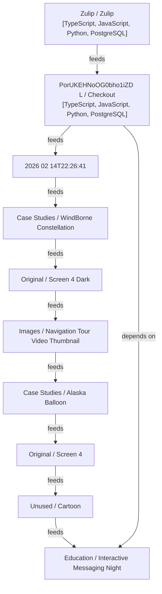

# High-Level Codebase Flow

## System Purpose
This summary was generated from the detailed structure report and is meant as a starting point for onboarding.

## Core Runtime Flow
The runtime likely starts at entry points, then moves through service/business logic, and finally reaches integration or storage layers.

## Main Components And Technologies
- Repository Structure Report: checkout
- Source
- Executive Summary
- Language Breakdown
- Top-Level Directory Analysis
- `static`
- `zerver`
- `locale`
- TypeScript
- JavaScript
- Python
- PostgreSQL

## Integration Boundaries
Identify external APIs, databases, queues, and infrastructure modules before changing core logic.

## Suggested Reading Order
1. Entry points and app bootstrap
2. Request handlers or orchestration layer
3. Core domain modules
4. Persistence and external integrations
5. Operational tooling and tests

## Known Unknowns
- This fallback summary is based only on markdown structure and may miss dynamic runtime behaviors.

## Mermaid Flowchart

